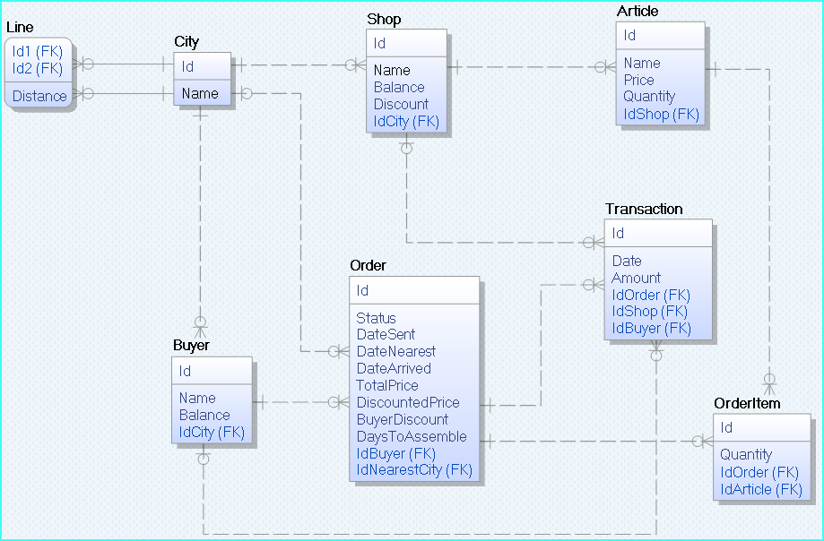
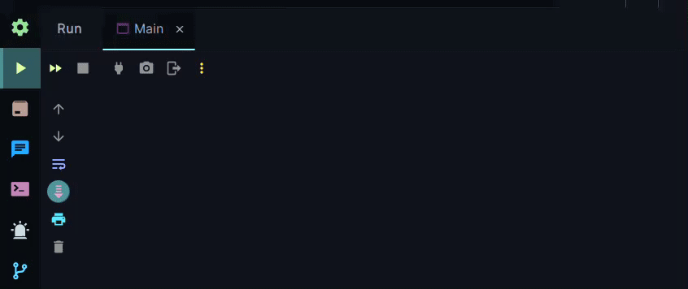

<div id="top"></div>

<!-- PROJECT [jovan-vukic] SHIELDS -->

<!-- PROJECT LOGO -->
<br />
<div align="center">
  <h2 align="center">Online Sales System</h2>

  <p align="center">
    A Java project simulating an online sales system for buyers and shops.
    Handles order creation, delivery, and payments.
    Utilizes city connections for transport and calculates discounts based on buyer's purchase history.
    <br />
    <a href="https://github.com/jovan-vukic/online-sales-system"><strong>Explore the project »</strong></a>
    <br />
    <br />
    <a href="https://github.com/jovan-vukic/online-sales-system/issues">Report Bug</a>
    ·
    <a href="https://github.com/jovan-vukic/online-sales-system/issues">Request Feature</a>
  </p>
</div>

<!-- TABLE OF CONTENTS -->
<details>
  <summary>Table of Contents</summary>
  <ol>
    <li>
      <a href="#about-the-project">About The Project</a>
    </li>
    <li>
      <a href="#implementation">Implementation</a>
    </li>
    <li>
      <a href="#getting-started">Getting Started</a>
      <ul>
         <li><a href="#installation">Installation</a></li>
         <li><a href="#usage">Usage</a></li>
      </ul>
    </li>
    <li><a href="#contributing">Contributing</a></li>
    <li><a href="#license">License</a></li>
    <li><a href="#contact">Contact</a></li>
    <li><a href="#acknowledgments">Acknowledgments</a></li>
  </ol>
</details>

<!-- ABOUT THE PROJECT -->

## About The Project



This project implements an online sales system that acts as an intermediary between buyers and shops for selling various products.
The system handles order creation, order delivery, and payments.

The system consists of shops located in different cities that advertise their products with prices and quantities.
Shops can define discounts that apply to all their products for a certain period.

Buyers can create orders by selecting products from multiple shops and specifying the quantities. After submitting the order, the system verifies if it can be fulfilled, proceeds with payment by deducting the amount from the buyer's virtual account within the system, and records each transaction separately. Once the payment is completed, the system automatically sends the order to the buyer. Orders have three states: "created" (order created but not completed), "sent" (order complete and sent to the buyer), and "arrived" (order has arrived in the buyer's city).

The cities are interconnected by transportation lines, allowing movement between them. The distance between cities is measured in transportation days. When an order is placed, it is transported in two steps. First, the products are transported from the respective shops to the nearest city (City A) that is closest to the buyer's city (City B). Then, the order is transported from City A to City B using the shortest path.

When an order arrives in the buyer's city, the system transfers the money to the associated shops. The system retains 5% of the total amount as profit and records each transaction with the shops individually.

The system also offers an additional 2% discount on orders if the buyer has made a transaction exceeding 10,000 in the last 30 days. In that case, the system reduces its profit from 5% to 3%.

<p align="right">(<a href="#top">back to top</a>)</p>

## Implementation

The project requires a database that is created according to the specifications provided here.

The project consists of classes with the prefix "Solution" that implement various interfaces and their respective methods.

Additional methods, fields, and elements can be added to the classes as necessary. However, it is essential to implement the methods defined in the interfaces, as they will be called during testing.

<p align="right">(<a href="#top">back to top</a>)</p>

<!-- GETTING STARTED -->

## Getting Started

To get a local copy up and running follow these simple steps.

### Installation

Setup:

1. Clone the repository:
   ```sh
   git clone https://github.com/jovan-vukic/online-sales-system.git
   ```
2. Set up the database by running the SQL script in the `db` directory.
3. Build and compile the project using your preferred Java IDE.
4. Run the project to perform the tests of the functionalities.

<p align="right">(<a href="#top">back to top</a>)</p>

<!-- USAGE EXAMPLES -->

### Usage

A full demonstration of the working project:



<p align="right">(<a href="#top">back to top</a>)</p>

<!-- CONTRIBUTING -->

## Contributing

Contributions are what makes the open source community such an amazing place to learn, inspire, and create. Any contributions you make are **greatly appreciated**.

If you have a suggestion that would make this better, please fork the repo and create a pull request. You can also simply open an issue with the tag "enhancement".
Don't forget to give the project a star! Thanks again!

1. Fork the Project
2. Create your Feature Branch (`git checkout -b feature/AmazingFeature`)
3. Commit your Changes (`git commit -m 'Add some AmazingFeature'`)
4. Push to the Branch (`git push origin feature/AmazingFeature`)
5. Open a Pull Request

<p align="right">(<a href="#top">back to top</a>)</p>

<!-- LICENSE -->

## License

Distributed under the MIT License. See `LICENSE` for more information.

<p align="right">(<a href="#top">back to top</a>)</p>

<!-- CONTACT -->

## Contact

Jovan - [@jovan-vukic](https://github.com/jovan-vukic)

Project Link: [https://github.com/jovan-vukic/online-sales-system](https://github.com/jovan-vukic/online-sales-system)

<p align="right">(<a href="#top">back to top</a>)</p>

<!-- ACKNOWLEDGMENTS -->

## Acknowledgments

Used resources:

- [The full specification of the project in the Serbian language](https://github.com/jovan-vukic/online-sales-system/blob/master/docs/SAB_projekat_2223.pdf)

<p align="right">(<a href="#top">back to top</a>)</p>
